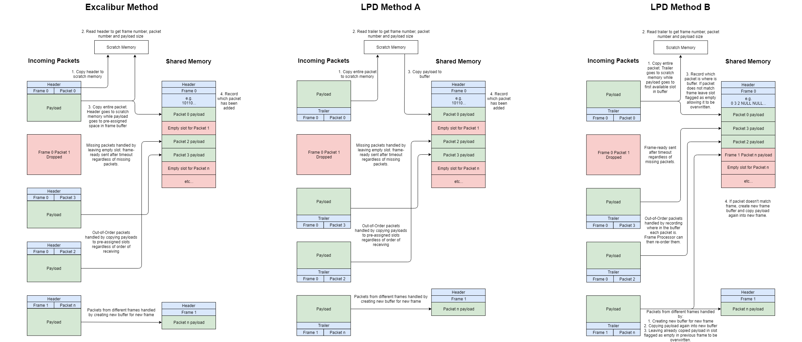

# LPD Odin Integration Requirements Specification

Create ODIN plugin to receive, process and store data from the LPD detector, replacing the existing python system. Duplicate, adapt and optimise existing [Excalibur](https://github.com/dls-controls/excalibur-detector) code to work for LPD.

*Note: This diagram represents the existing Excalibur system that the LPD system will be built from, not the eventual LPD system itself however there is currently no reason to assume this diagram requires any change beyond renaming.*

## LPD Frame Producer
Priority: Should Have

Port Excalibur frame producer script to simulate LPD packet flow.

| Requirement | Conditions | Status |
|:-----------:|:----------:|:-------:|
| All detector specific names use `lpd`, `Lpd` or `LPD`. | No detector specific names for files, class, functions, variables, object or keys referring to Excalibur or other non-LPD detectors. Script still functions with no resulting errors. | 19/06/18: Complete |
| Retrieve frame number, packet number and SOF/EOF from last 8 bytes (trailer) of UDP packet rather than first 8 bytes (header) without error. | All retrieved data matches that of pcap file | 18/06/18: Complete |
| Remove Excalibur subframe handling from script. | Script stills handles and packages data correctly, sent frames match pcap file. | 21/06/18: Complete |

## LPD Frame Receiver
Priority: Must Have

Port frame receiver for LPD.

| Requirement | Conditions | Status |
|:-----------:|:----------:|:------:|
| All detector specific names use `lpd`, `Lpd` or `LPD`. | No detector specific names for files, class, functions, variables, object or keys referring to `Excalibur` or other non-LPD detectors. Script still functions with no resulting errors. | 26/07/18: Complete |
| Upon startup, read config and create shared memory buffer. | Shared memory buffer created with name specified in config. | 29/06/18: Complete |
| Listen for buffer config request from FP. Reply upon request. | Receive request for buffer config from any FP on ZeroMQ address specified in config. | 29/06/18: Complete |
| Listen for incoming UDP packets. Upon detection, trigger decoder. | Packets sent to specified port are received and read. | 29/06/18: Complete |
| Add packet payload to shared memory buffer. | Add packet to frame buffer. Packets should be added to correct frame. Create new frame for packets not matching existing frames in buffer. | 26/07/18: Method C complete |
| Handle packet loss. | Timeout frame after specified time. Send frame-ready with empty buffers in frame making note of how many packets were dropped. | 29/06/18: Method C Complete |
| Handle out-of-order packets. | Packet payload position in buffer recorded in frame buffer header. | 26/07/18: Method C Complete |
| Upon filled/timed out frame. FR control thread sends frame-ready message to FP. | Frame-ready message sent from RX thread to control thread then sent to FP. | 29/06/18: Complete |
| When FR control thread receives frame-release message from FP, FR RX thread empties and opens buffer for re-use. | Frame-release message received from FP. Buffer emptied and made available for new frame. | 29/06/18: Complete |
| Remove multiple FEM handling. | Remove all unnecessary code relating to FEM mapping and indexing. LPD should only use one FEM. | 03/09/18: Complete |
| Remove bit depth handling. | Remove all unnecessary code relating to possible bit depth settings. LPD does not use them. | 31/08/18: Complete |
| Remove sub-frame handling. | Remove all unnecessary code relating sub-frames within frames. LPD does not use sub-frames. | 29/06/18: Complete |

The major change for the FR will be switching to reading the trailer of incoming packets rather than the header as Excalibur does. This is shown below with two possible methods of handling trailers.

Method A is simpler and retains the handling for out-of-order and lost packets however it requires copying the entire packet twice for every packet. With hundreds of packets every second this very resource intensive and likely too slow. (Complete)

Method B is more complex but packets are only copied more than once if it belongs to a different frame. Packets may be stored in the wrong order though this information is stored in the buffer and can be used to rearrange the data when needed. (Tested, not functional)

Method C involves copying the entire packet into the next available position then it reads the trailer. The next packet then overlaps the trailer of the previous one. The position of the payload is stored in the frame header. (Complete, this method is the one chosen after testing all three)

## LPD Frame Processor
Priority: Must Have

Port frame processor for LPD.

| Requirement | Conditions | Status |
|:-----------:|:----------:|:------:|
| All detector specific names use `lpd`, `Lpd` or `LPD`. | No detector specific names for files, class, functions, variables, object or keys referring to `Excalibur` or other non-LPD detectors. Script still functions with no resulting errors. | 29/06/18: Complete |
| Upon startup, request shared memory configuration from FR. | Send request for buffer config to any FR on ZeroMQ address specifed in config. | 29/06/18: Complete |
| Listen for frame-ready notification from FR. Upon receiving, trigger proccessing. | Upon receiving frame-ready, read buffer, make note of missing packets, trigger frame process plugin. | 29/06/18: Complete |
| Reorder incoming frame data into images with the correct pixel data order. | 20 images per frame each in correct order. Skip frame header and train header. | 31/08/18: Complete |
| Write frame to HDF5 file. Send frame-release to FR upon completion. | File must contain all data from frame including 20 separate images per frame, the frame numbers and image numbers. Send frame-release to FR upon completion.  | 29/06/18: Complete |
| Remove multiple FEM handling. | Remove all unnecessary code relating to FEM mapping and indexing. LPD should only use one FEM. | 03/09/18: Complete |
| Remove bit depth handling. | Remove all unnecessary code relating to possible bit depth settings. LPD does not use them. | 31/08/18: Complete |
| Remove sub-frame handling. | Remove all unnecessary code relating sub-frames within frames. LPD does not use sub-frames. | 10/08/18: Complete |

## Travis CI Testing
Priority: Should Have

Use Travis CI to create testing for the above.

*NOTE: Exact requirements yet to be decided.*

## Control Integration
Priority: Should Have

Integrate existing LPD python GUI with frame receiver and processor.

*NOTE: Exact requirements yet to be decided.*

## Live View
Priority: Could Have

Adapt ODIN to allow live view within GUI to still work.

*NOTE: Exact requirements yet to be decided.*
