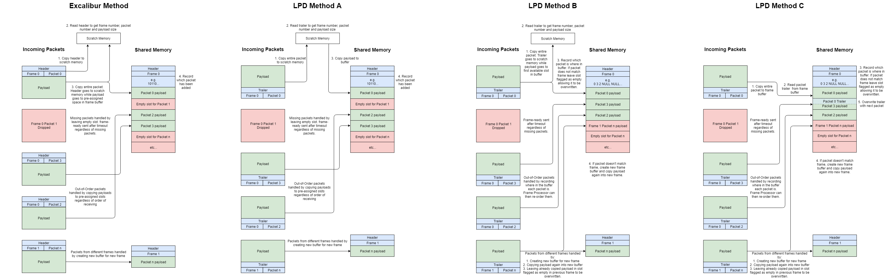

# LPD Odin Integration Requirements Specification

Create ODIN plugin to receive, process and store data from the LPD detector, replacing the existing python system. Duplicate, adapt and optimise existing [Excalibur](https://github.com/dls-controls/excalibur-detector) code to work for LPD.

*Note: This diagram represents the existing Excalibur system that the LPD system will be built from, not the eventual LPD system itself however there is currently no reason to assume this diagram requires any change beyond renaming.*

## LPD Frame Producer
Priority: Should Have

Port Excalibur frame producer script to simulate LPD packet flow.

| Requirement | Conditions | Status |
|:-----------:|:----------:|:-------:|
| All detector specific names use `lpd`, `Lpd` or `LPD`. | No detector specific names for files, class, functions, variables, object or keys referring to Excalibur or other non-LPD detectors. Script still functions with no resulting errors. | 19/06/18: Complete |
| Retrieve frame number, packet number and SOF/EOF from last 8 bytes (trailer) of UDP packet rather than first 8 bytes (header) without error. | All retrieved data matches that of pcap file | 18/06/18: Complete |
| Remove Excalibur subframe handling from script. | Script stills handles and packages data correctly, sent frames match pcap file. | 21/06/18: Complete |

## LPD Frame Receiver
Priority: Must Have

Port frame receiver for LPD.

| Requirement | Conditions | Status |
|:-----------:|:----------:|:------:|
| All detector specific names use `lpd`, `Lpd` or `LPD`. | No detector specific names for files, class, functions, variables, object or keys referring to `Excalibur` or other non-LPD detectors. Script still functions with no resulting errors. | 29/06/18: Functional with Excalibur pcap & producer after rename. Functionality with LPD pcap & producer not yet functional. |
| Upon startup, read config and create shared memory buffer. | Shared memory buffer created with name specified in config. | 29/06/18: Still functional from original Excalibur script |
| Listen for buffer config request from FP. Reply upon request. | Receive request for buffer config from any FP on ZeroMQ address specified in config. | 29/06/18: Still functional from original Excalibur script |
| Listen for incoming UDP packets. Upon detection, trigger decoder. | Packets sent to specified port are received and read. | 29/06/18: Still functional from original Excalibur script |
| Add packet payload to shared memory buffer. | Add packet to frame buffer. Packets should be added to correct frame. Create new frame for packets not matching existing frames in buffer. | 29/06/18: Appears to remain functional from original Excalibur script. Contents of buffer not examined. |
| Handle packet loss. | Timeout frame after specified time. Send frame-ready with empty buffers in frame making note of how many packets were dropped. | 29/06/18: Still functional from original Excalibur script. |
| Handle out-of-order packets. | Packet payload position in buffer recorded in frame buffer header. | 29/06/18: Original Excalibur system still in place. This should be replaced with LPD compatible system. |
| Upon filled/timed out frame. FR control thread sends frame-ready message to FP. | Frame-ready message sent from RX thread to control thread then sent to FP. | 29/06/18: Still functional from original Excalibur script |
| When FR control thread receives frame-release message from FP, FR RX thread empties and opens buffer for re-use. | Frame-release message received from FP. Buffer emptied and made available for new frame. | 29/06/18: Still functional from original Excalibur script. Frame-release received, buffer repurposing not properly tested. |

The major change for the FR will be switching to reading the trailer of incoming packets rather than the header as Excalibur does. This is shown below with two possible methods of handling trailers.

Method A is simpler and retains the handling for out-of-order and lost packets however it requires copying the entire packet twice for every packet. With hundreds of packets every second this very resource intensive and likely too slow.

Method B is more complex but packets are only copied more than once if it belongs to a different frame. Packets may be stored in the wrong order though this information is stored in the buffer and can be used to rearrange the data when needed.

Both methods should be tested but if method B is effective then it should take priority over method A.

## LPD Frame Processor
Priority: Must Have

Port frame processor for LPD.

| Requirement | Conditions | Status |
|:-----------:|:----------:|:------:|
| All detector specific names use `lpd`, `Lpd` or `LPD`. | No detector specific names for files, class, functions, variables, object or keys referring to `Excalibur` or other non-LPD detectors. Script still functions with no resulting errors. | 29/06/18: Functional with Excalibur pcap & producer after rename. Functionality with LPD pcap & producer not yet functional. |
| Upon startup, request shared memory configuration from FR. | Send request for buffer config to any FR on ZeroMQ address specifed in config. | 29/06/18: Still functional from original Excalibur script |
| Listen for frame-ready notification from FR. Upon receiving, trigger file writer. | Upon receiving frame-ready, read buffer, make note of missing packets, trigger writer. | 29/06/18: Still functional from original Excalibur script |
| Write frame to HDF5 file. Send frame-release to FR upon completion. | File must contain all data from frame including information about missing packets and appropriate metadata. | 29/06/18: Still functional from original Excalibur script |

## Travis CI Testing
Priority: Should Have

Use Travis CI to create testing for the above.

*NOTE: Exact requirements yet to be decided.*

## Control Integration
Priority: Should Have

Integrate existing LPD python GUI with frame receiver and processor.

*NOTE: Exact requirements yet to be decided.*

## Live View
Priority: Could Have

Adapt ODIN to allow live view within GUI to still work.

*NOTE: Exact requirements yet to be decided.*

